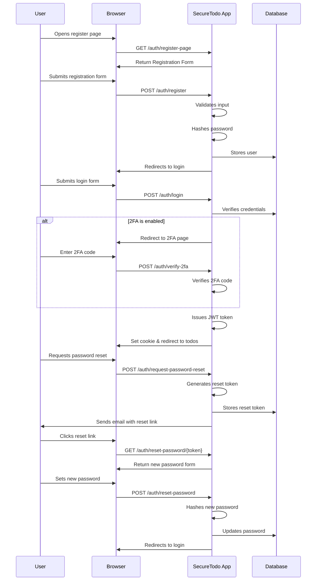
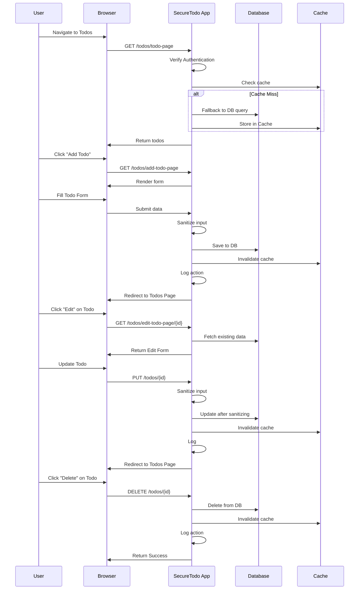
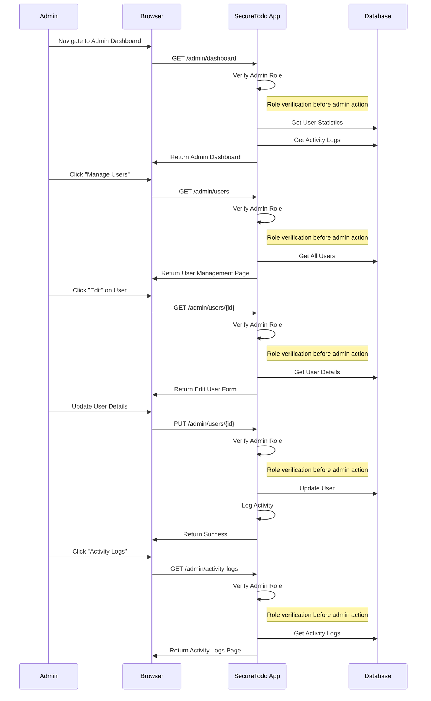

# SecureTodo Application Flowchart

This document contains flowcharts representing the architecture and flow of the SecureTodo application.

## Application Architecture

```mermaid
graph TD
    %% Client Layer
    Client[Client Browser] --> |HTTP Request| FastAPI[FastAPI Application]

    %% Middleware Layer
    subgraph Middleware
        CSP[CSP Middleware]
        CSRF[CSRF Middleware]
    end
    FastAPI --> CSP
    FastAPI --> CSRF

    %% Router Layer
    subgraph Routers
        AuthRouter[Auth Router]
        TodosRouter[Todos Router]
        AdminRouter[Admin Router]
        UsersRouter[Users Router]
    end
    FastAPI --> AuthRouter
    FastAPI --> TodosRouter
    FastAPI --> AdminRouter
    FastAPI --> UsersRouter

    %% Auth Components
    subgraph Auth Modules
        Login[Login Module]
        Registration[Registration Module]
        PasswordReset[Password Reset Module]
        TwoFactor[Two-Factor Auth Module]
        TokenManager[Token Manager]
    end
    AuthRouter --> Login
    AuthRouter --> Registration
    AuthRouter --> PasswordReset
    AuthRouter --> TwoFactor
    AuthRouter --> TokenManager

    %% Security Components
    subgraph Security
        PasswordValidator[Password Validator]
        RateLimiter[Rate Limiter]
    end
    Login --> PasswordValidator
    Registration --> PasswordValidator
    PasswordReset --> PasswordValidator
    Login --> RateLimiter
    Registration --> RateLimiter

    %% Database Layer
    subgraph Database Layer
        Database[(Database)]
        Users[Users Model]
        Todos[Todos Model]
        ActivityLog[Activity Log Model]
        RevokedTokens[Revoked Tokens Model]
    end
    TodosRouter --> |CRUD Operations| Database
    AuthRouter --> |User Operations| Database
    AdminRouter --> |Admin Operations| Database
    UsersRouter --> |User Management| Database
    Database --> Users
    Database --> Todos
    Database --> ActivityLog
    Database --> RevokedTokens

    %% Utilities
    subgraph Utilities
        ActivityLogger[Activity Logger]
        Cache[Cache]
    end
    TodosRouter --> ActivityLogger
    AuthRouter --> ActivityLogger
    AdminRouter --> ActivityLogger
    UsersRouter --> ActivityLogger
    TodosRouter --> Cache

    %% Email
    subgraph Email
        EmailUtils[Email Utilities]
    end
    PasswordReset --> EmailUtils
    Registration --> EmailUtils
```

## Authentication Flow

## Todo Management Flow

## Admin Flow

