# SecureTodo Application Flowchart

This document contains flowcharts representing the architecture and flow of the SecureTodo application.

## Application Architecture

The SecureTodo application architecture is divided into several logical components:

### Client and Middleware Layer

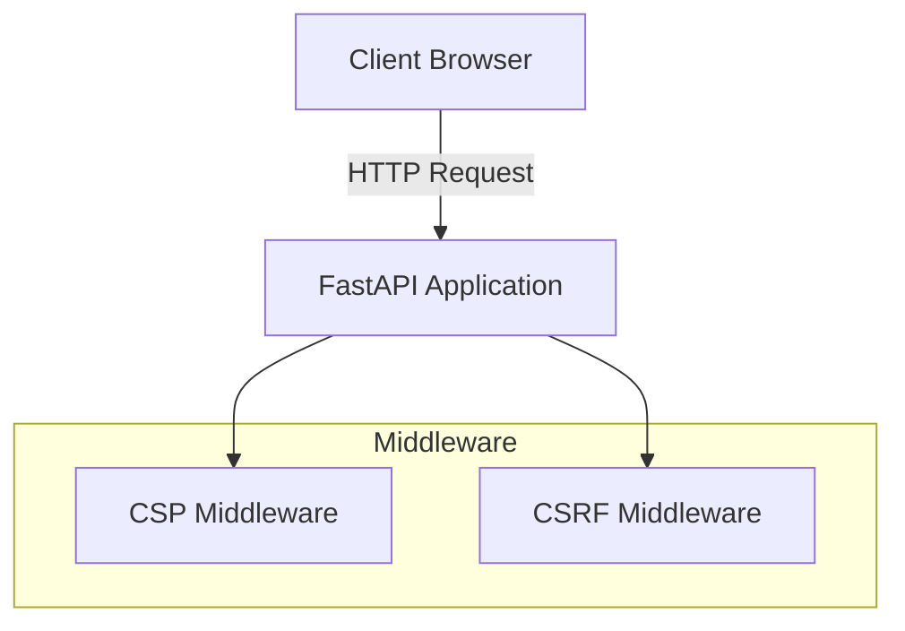

### Router Layer

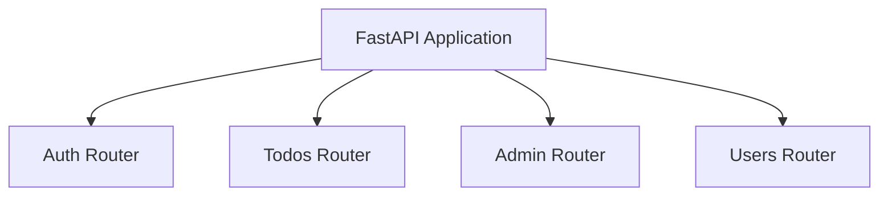

### Authentication Components

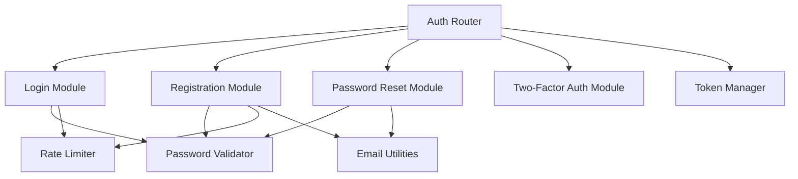

### Database Layer

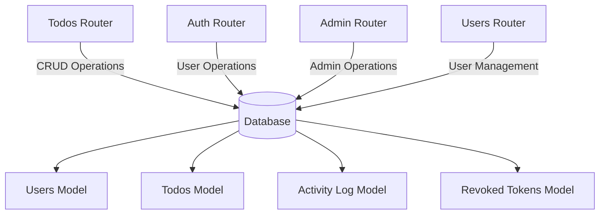

### Utilities Layer

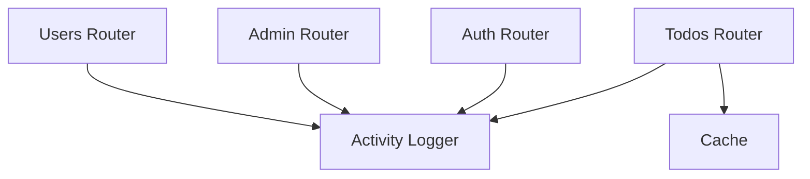

## Registration Process

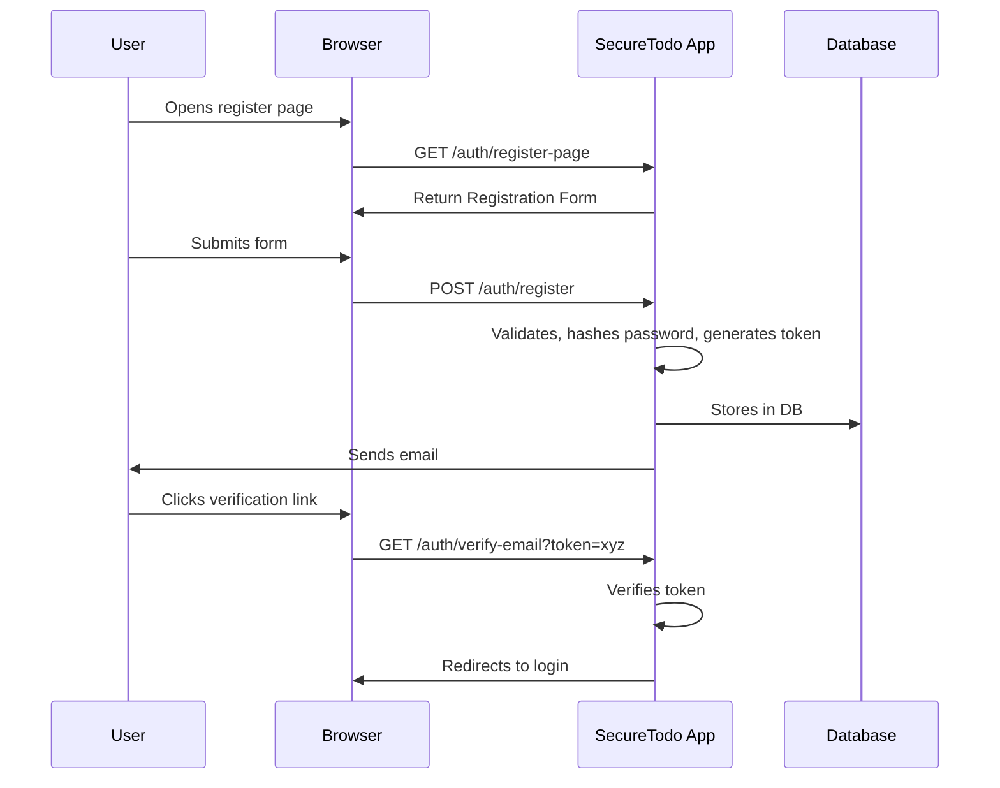

## Login Flow

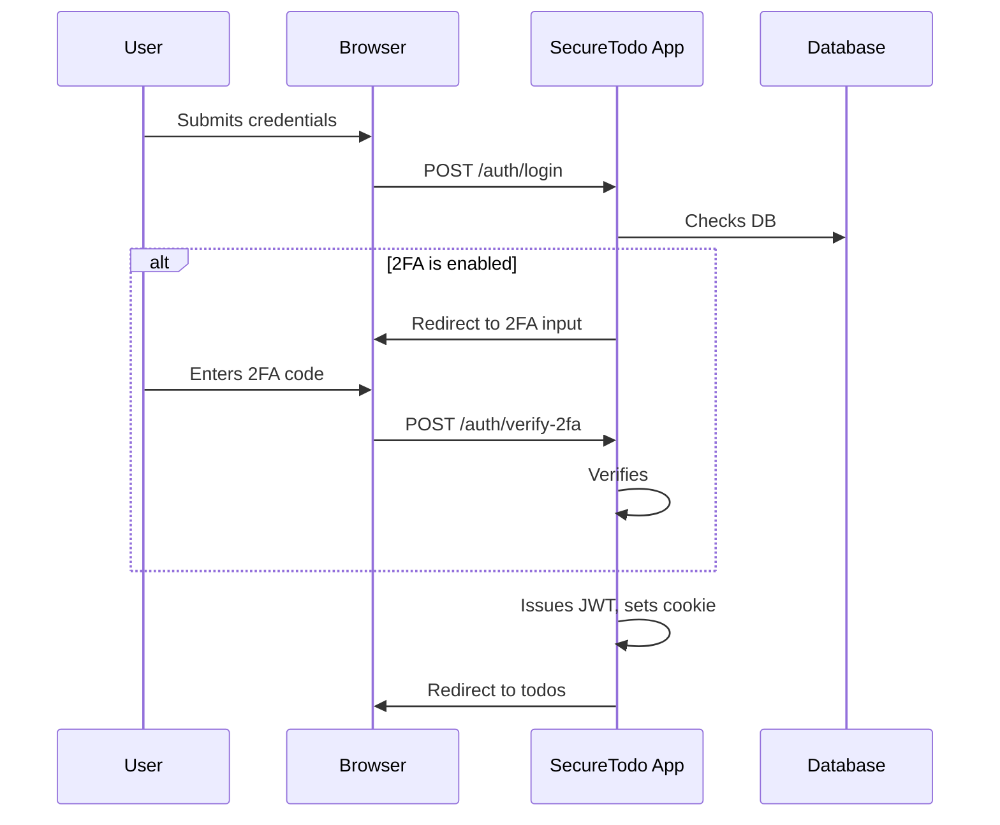

## Password Reset Flow

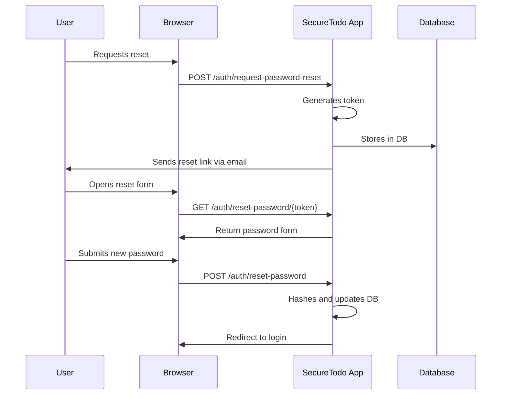

## Viewing Todos

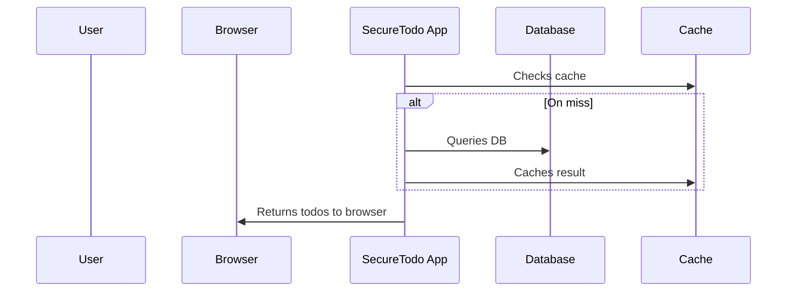

## Adding a Todo

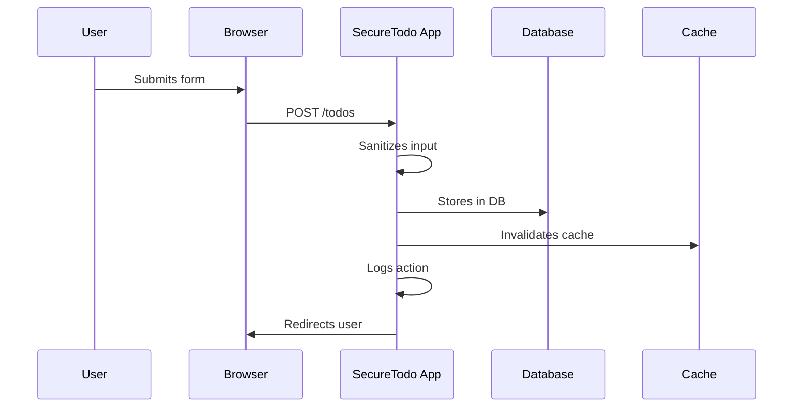

## Editing a Todo

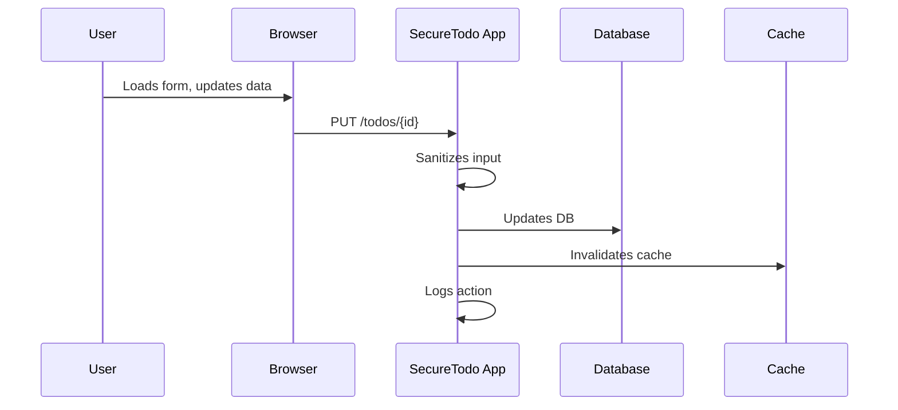

## Deleting a Todo

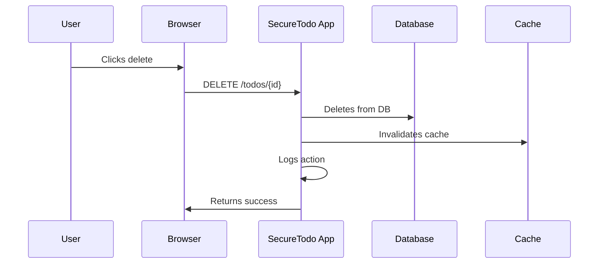

## Admin Dashboard Load

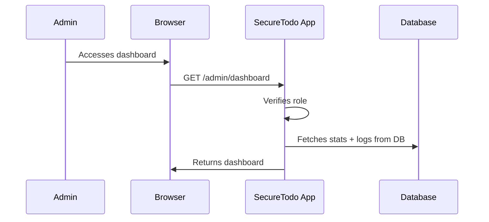

## Admin Managing Users

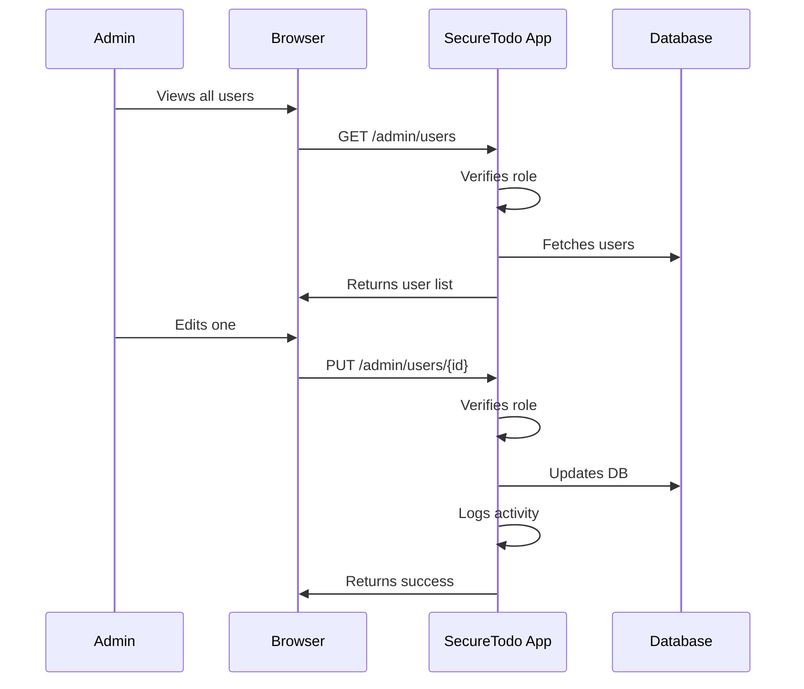

## Admin Viewing Activity Logs

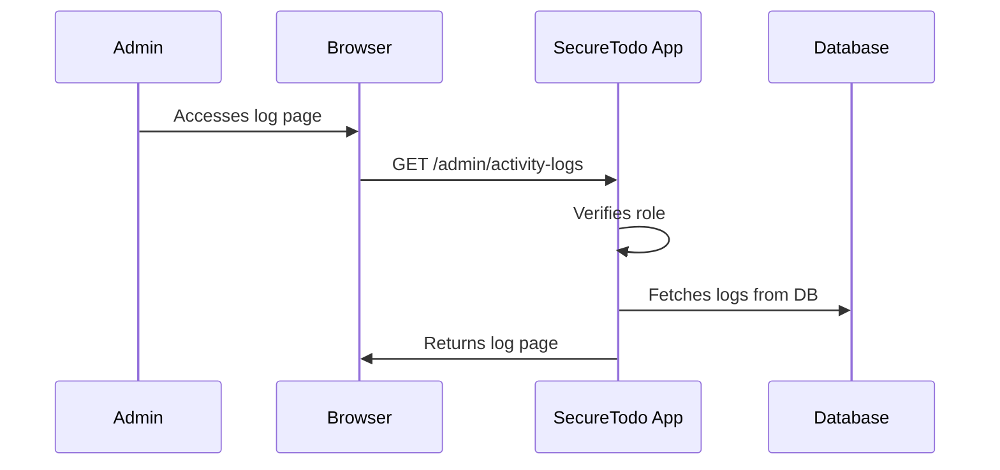
